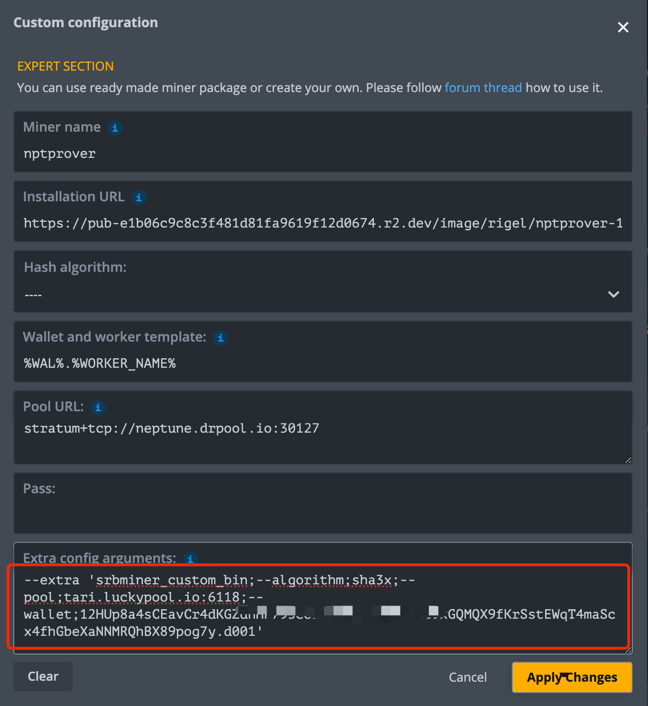

# Dual Mining
Dual Mining integrates third-party software and pools. Drpool does not track earnings from this part—please refer to your configured pool address for third-party software earnings.

Third parties control this fee rate—Drpool does not interfere.​​

Since third-party software is involved, Drpool cannot guarantee its stable operation. Miners should monitor it accordingly.

For any runtime issues, communicate in the community.

[Neptune + SRBMiner](#neptune--srbminer):NPT+XTM   
[Neptune + RigelMiner](#neptune--rigelminer):NTP+(ABEL/ALPH/ERG/ETC/.../QUAI)

## Neptune + SRBMiner

### ​Relevant materials
- **Pool**   https://tari.luckypool.io/
- **Prover** https://github.com/doktor83/SRBMiner-Multi

### Start

#### Setup on Ubuntu
- version >=1.0.6
- Modify the `inner_guesser.sh` file
   ```sh
   #!/bin/bash

   # set your own drpool accountname
   accountname="accountname.miner001"
   
   pids=$(ps -ef | grep dr_neptune_prover | grep -v grep | awk '{print $2}')
   if [ -n "$pids" ]; then
       echo "$pids" | xargs kill
       sleep 5
   fi
   
   while true; do
       target=$(ps aux | grep dr_neptune_prover | grep -v grep)
       if [ -z "$target" ]; then
           ./dr_neptune_prover --pool stratum+tcp://neptune.drpool.io:30127 --worker $accountname --extra "srbminer_custom_bin;--algorithm;sha3x;--pool;tari.luckypool.io:6118;--wallet;<tariaddress>.<devicename>"
           sleep 5
       fi
       sleep 60
   done
   ```
   - `srbminer_custom_bin`: Software name (non-editable)​​
   - `tariaddress`: Replace with the miner's own Tari wallet address, [Statistics Overview](https://tari.luckypool.io/miner-stats#workers)  
   - `devicename`: Replace with the miner's own device name

#### Setup on HiveOS
- version >=1.0.6
    
- Custom configuration->Extra config arguments:`--extra 'srbminer_custom_bin;--algorithm;sha3x;--pool;tari.luckypool.io:6118;--wallet;<tariaddress>.<devicename>'`
   - `srbminer_custom_bin`: Software name (non-editable)​​
   - `tariaddress`: Replace with the miner's own Tari wallet address, [Statistics Overview](https://tari.luckypool.io/miner-stats#workers)  
   - `devicename`: Replace with the miner's own device name
   - Other parameter descriptions refer to:​[Parameters](https://github.com/doktor83/SRBMiner-Multi/blob/master/Parameters), keys and values are linked by ";".

## Neptune + RigelMiner

### ​Relevant materials
GitHub: https://github.com/rigelminer/rigel

### Start

#### Setup on Ubuntu
- version >=1.0.6
- Modify the `inner_guesser.sh` file
   ```sh
   #!/bin/bash

   # set your own drpool accountname
   accountname="accountname.miner001"
   
   pids=$(ps -ef | grep dr_neptune_prover | grep -v grep | awk '{print $2}')
   if [ -n "$pids" ]; then
       echo "$pids" | xargs kill
       sleep 5
   fi
   
   while true; do
       target=$(ps aux | grep dr_neptune_prover | grep -v grep)
       if [ -z "$target" ]; then
           ./dr_neptune_prover --pool stratum+tcp://neptune.drpool.io:30127 --worker $accountname --extra "rigel;<>;<>;<>"
           sleep 5
       fi
       sleep 60
   done
   ```
   - `rigel`: Software name (non-editable)​​
   - [extra configuration](#extra-configuration)

#### Setup on HiveOS
- version >=1.0.7
- Custom configuration->Extra config arguments:`--extra 'rigel;<>;<>;<>'`
   - `rigel`: Software name (non-editable)​​
   - [extra configuration](#extra-configuration)

### extra configuration​

#### ETC

etc.sh
```sh
'./rigel -a etchash -o stratum+ssl://etc.2miners.com:11010 -u YOUR_ETC_WALLET -w my_rig --log-file logs/miner.log'
```

extra
```sh
--extra 'rigel;-a;etchash;-o;stratum+ssl://etc.2miners.com:11010;-u;YOUR_ETC_WALLET;-w;my_rig'
```
